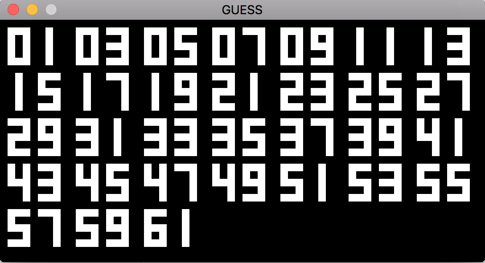
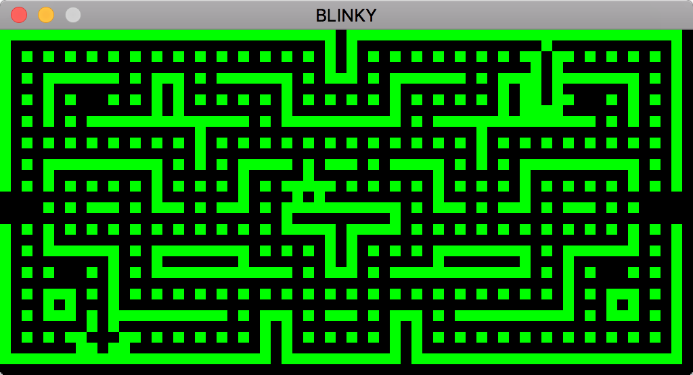
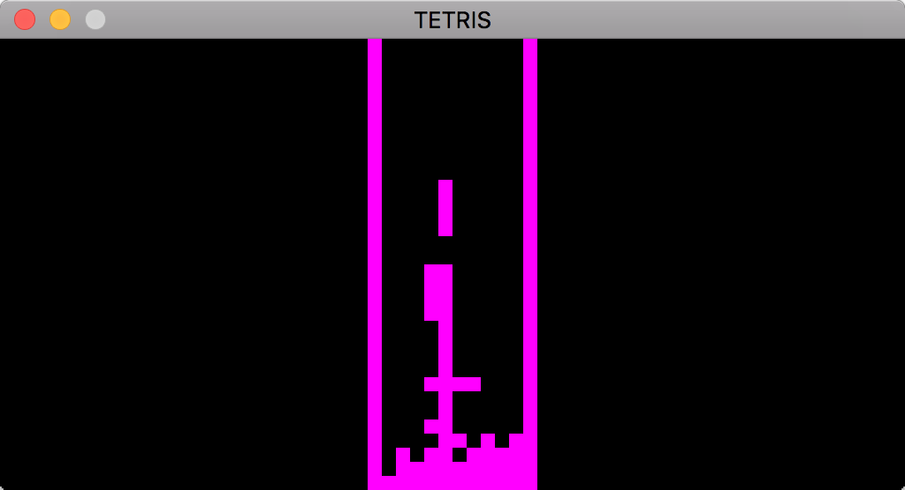
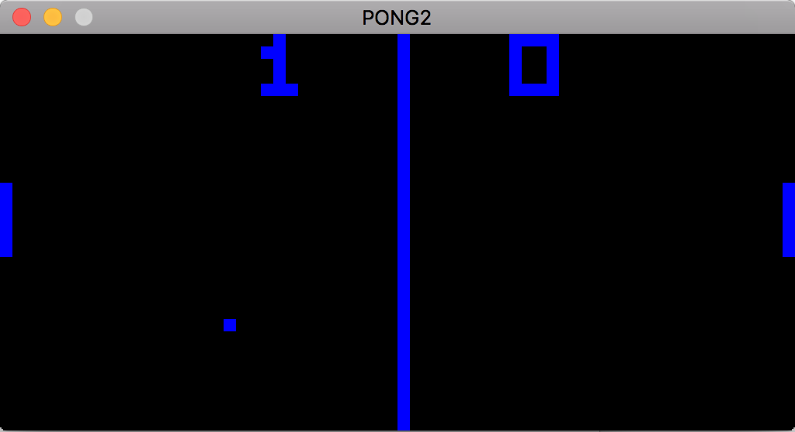

# Emular

## Description
Emular is a [Chip-8](https://en.wikipedia.org/wiki/CHIP-8) interpreter and debugger written in Ruby. It is my first adventure in writing emulators, and for this first time I chose a programming language I know well, so that's why Ruby.

## Status
Although there are a few Chip-8 versions, I stick with the 35 (or so) opcodes from the original instruction set. That means that the ROMS that are in the public domain all seem to work just fine currently. It should be quite easy to extend this Chip-8 emulator in something like Super Chip or Chip-48.

## Screenshots





## Dependencies
Emular is a pretty simple Ruby program, to draw pixels it needs is [Gosu](https://www.libgosu.org/ruby.html), which is a 2D game development library. Gosu is using [SDL](https://www.libsdl.org) for graphics, so to get these two libaries, you can do:

```
gem install gosu
```

And install SDL with homebrew:

```
brew install sdl2
```

Everything else is done through Ruby.

## Usage
Basically Emular is a tiny computer, but now written in software, which executes the Rom that is loaded when you start. That Rom contains hexadecimal data which represents the instructions to execute the program.

Start a game: 

```
ruby main.rb [GAME], i.e. ruby main.rb BLINKY
```

List the games: 

```
ruby main.rb games
```

Change the size with -s x, good values are 4 and 8: 

```
ruby main.rb -s 8 GUESS
```

Change the color with -c color, leaving out this option gives you white pixels: 

```
ruby main.rb -c green GUESS
```

Combinations are possible: 

```
ruby main.rb -s 4 -c blue GUESS
```


Emular comes with a full debugger which is a great tool to learn about Chip-8 and what it's exactly doing with memory and the registers of the computer.

## Debugging
Start a debugger with the -d option, and you drop into a command line: 

```
ruby main.rb -d GUESS
```

All Chip-8 games start at 0x200, so the program counter (PC) is pointing to the first instruction of the game. Here's a little demo of things you could do:
```
$ ruby main.rb -d GUESS
running with the debugger
0x200 (512) > b 520
set breakpoint at 0x208 (520), see all breakpoints with 'b'
0x200 (512) > b
breakpoints:
0: 0x208 (520)
delete a breakpoint with db x
0x200 (512) > c
0x200 (512) 6e01: LD Vx, byte			 => LD Ve <-- 0x01 (1)
0x202 (514) 00e0: CLS				       => CLS
0x204 (516) 6d01: LD Vx, byte			 => LD Vd <-- 0x01 (1)
0x206 (518) 6a01: LD Vx, byte			 => LD Va <-- 0x01 (1)
breakpoint hit at 0x208 (520)
0x208 (520) > r
v0: 0x00 (0)			v1: 0x00 (0)			v2: 0x00 (0)			v3: 0x00 (0)		
v4: 0x00 (0)			v5: 0x00 (0)			v6: 0x00 (0)			v7: 0x00 (0)		
v8: 0x00 (0)			v9: 0x00 (0)			va: 0x01 (1)			vb: 0x00 (0)		
vc: 0x00 (0)			vd: 0x01 (1)			ve: 0x01 (1)			vf: 0x00 (0)		
i: 0x00 (0) dt: 0x00 (0) st: 0x00 (0)
breakpoint hit at 0x208 (520)
0x208 (520) > l
>*  0x208 (520) 6b01: LD Vx, byte			  => LD Vb <-- 0x01 (1)
    0x20a (522) 8cd0: LD Vx, Vy			    => LD Vc, Vd
    0x20c (524) 8ce2: AND Vx, Vy			  => AND Vc, Ve
    0x20e (526) 4c00: SNE Vx, byte		  => SNE Vc != 00
    0x210 (528) 1220: JP addr			      => JP 0x220 (544)
    0x212 (530) 88d0: LD Vx, Vy			    => LD V8, Vd
    0x214 (532) 223e: CALL addr			    => CALL 0x23e (574)
    0x216 (534) 3a40: SE Vx, byte			  => SE Va == 40
    0x218 (536) 1220: JP addr			      => JP 0x220 (544)
    0x21a (538) 6a01: LD Vx, byte			  => LD Va <-- 0x01 (1)
breakpoint hit at 0x208 (520)
0x208 (520) > s
0x208 (520) 6b01: LD Vx, byte			 => LD Vb <-- 0x01 (1)
0x20a (522) > l 10
list 10
    0x200 (512) 6e01: LD Vx, byte			  => LD Ve <-- 0x01 (1)
    0x202 (514) 00e0: CLS				        => CLS
    0x204 (516) 6d01: LD Vx, byte			  => LD Vd <-- 0x01 (1)
    0x206 (518) 6a01: LD Vx, byte			  => LD Va <-- 0x01 (1)
 *  0x208 (520) 6b01: LD Vx, byte			  => LD Vb <-- 0x01 (1)
>   0x20a (522) 8cd0: LD Vx, Vy			    => LD Vc, Vd
    0x20c (524) 8ce2: AND Vx, Vy			  => AND Vc, Ve
    0x20e (526) 4c00: SNE Vx, byte			=> SNE Vc != 00
    0x210 (528) 1220: JP addr			      => JP 0x220 (544)
    0x212 (530) 88d0: LD Vx, Vy			    => LD V8, Vd
0x20a (522) > q
"bye!"
```

So what happens here is that a breakpoint is set at memory location 512 and execution resumes with 'c' (continue), the debugger stops when we hit the breakpoint, not executing the instruction at that location. We can inspect the registers of the Chip-8 cpu with 'r' and see the rest of the program with 'l' (list). The list command has some more tricks as we'll see in a moment. Next we execute one instruction, the one we hit with our breakpoint, by using 's' (step). Lastly we use 'l' once more, but now we add '10', so we will see 10 lines surrounding the pc. The list let you see the location of the pc (>) and any breakpoints (*). Finally we quit our little debug session with 'q'.

Another handy debug command is for memory inspection, which let you see the raw memory. Find out all debug commands by typing 'h' in the debug console.


## Compatibility
You can play the games using the keyboard. Chip-8 is using a bit of a weird layout, so let's use a picture to explain it:

| Chip-8 | Keyboard |
| --- | --- |
| <kbd>1</kbd><kbd>2</kbd><kbd>3</kbd><kbd>C</kbd> | <kbd>1</kbd><kbd>2</kbd><kbd>3</kbd><kbd>4</kbd> |
| <kbd>4</kbd><kbd>5</kbd><kbd>6</kbd><kbd>D</kbd> | <kbd>Q</kbd><kbd>W</kbd><kbd>E</kbd><kbd>R</kbd> |
| <kbd>7</kbd><kbd>8</kbd><kbd>9</kbd><kbd>E</kbd> | <kbd>A</kbd><kbd>S</kbd><kbd>D</kbd><kbd>F</kbd> |
| <kbd>A</kbd><kbd>0</kbd><kbd>B</kbd><kbd>F</kbd> | <kbd>Z</kbd><kbd>X</kbd><kbd>C</kbd><kbd>V</kbd> |

The Roms are coming from David Winter's Chip-8 Emulation Page (http://www.pong-story.com/chip8/)

| Game | Status | Notes |
| --- | --- | --- |
| 15PUZZLE | ✅ | |
| BLINKY | ✅ | Pacman; Nice game, plays fine, although ghost behavior seems a bit off |
| BLITZ | ✅ |  |
| BRIX | ✅ |  |
| CONNECT4 | ✅ | |
| GUESS | ✅ | I used this to find most of the missing instructions, plays fine |
| HIDDEN | ✅ | |
| INVADERS | ✅ | Nice game, plays fine |
| KALEID | ✅ |  |
| MAZE | ✅ | Not really a game, but seems to work well |
| MERLIN | ✅ | |
| MISSILE | ✅ | |
| PONG | ✅ | |
| PONG2 | ✅ |  |
| PUZZLE | ✅ | |
| SYZYGY | ✅ | |
| TANK | ✅ | |
| TETRIS | ✅ | Nice game, plays fine |
| TICTAC | ✅ | |
| UFO | ✅ | |
| VBRIX | ✅ | |
| VERS | ✅ | |
| WIPEOFF | ✅ | |
